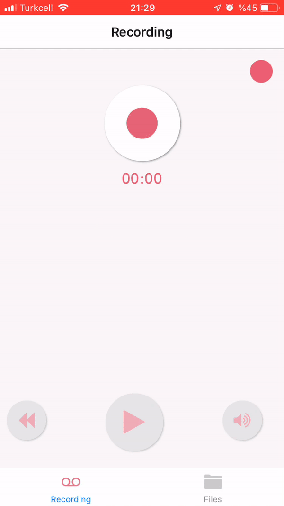
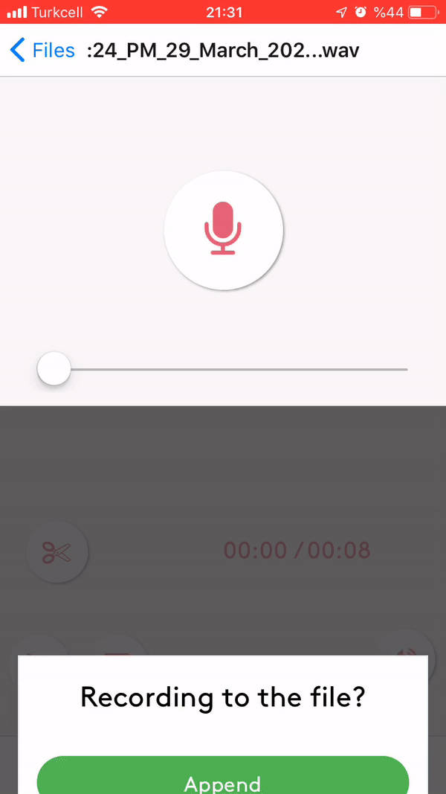

# React Native Audio Trimmer

An app to record & play audio and also trim the recorded audio or append & prepend  or overwrite to recorded audio.

## Application Setup

The application was created with create-react-app with Expo. Also App is available in [AppStore](https://apps.apple.com/tr/app/my-audio-recorder/id1499911239)

## User Guide

Simply record an audio and save as a file.

Trim the recorder file and save as a different file.

Append & Prepend or Overwrite to an existing recording.

## Built with

* This project was bootstrapped with [Create React App](https://github.com/facebook/create-react-app).
* [audiu-buffer-utils](hhttps://www.npmjs.com/package/audio-buffer-utils) is used to edit an existing audio.
* [audiu-buffer-from](https://www.npmjs.com/package/audio-buffer-from) is used to create an audio buffer from a base64 string.
* [base64-arraybuffer](https://www.npmjs.com/package/base64-arraybuffer) is used to decode or encode the data.
* [audiobuffer-to-wav](hhttps://www.npmjs.com/package/audiobuffer-to-wav) is used to convert audio buffer to wave array buffer
* [react-navigation](hhttps://reactnavigation.org/) is used to create a tab navigator.
* [Expo-Av](https://docs.expo.io/versions/latest/sdk/av/) Audio API is used for record & play functionalities.
* [Expo-File-System](https://docs.expo.io/versions/v37.0.0/sdk/filesystem/) FileSystem API is used to save & create files.
* [Expo-Permissions](https://docs.expo.io/versions/v37.0.0/sdk/permissions/) Permissions API is used to ask permission to reach the microphone.
* [PropTypes](https://www.npmjs.com/package/prop-types) is used to type checking.
* [react-native-canvas](https://www.npmjs.com/package/react-native-canvas) is used to create & use canvas.
* [Redux](https://redux.js.org/) for state management.
* [Styled-components](https://styled-components.com/) to create resuable and more organised components.

